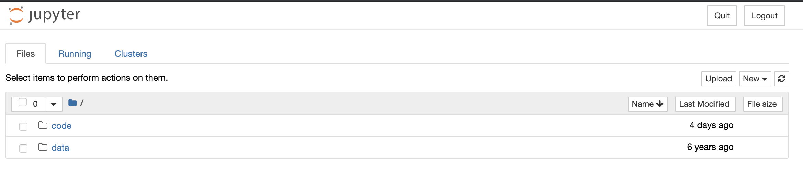
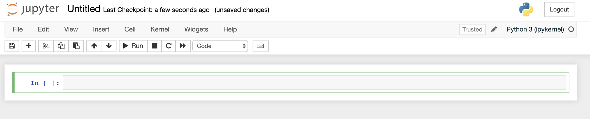
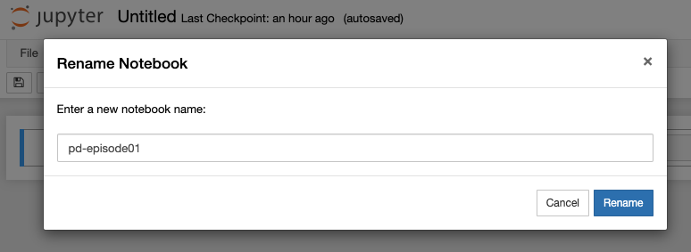
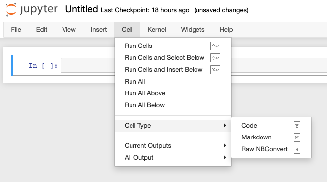
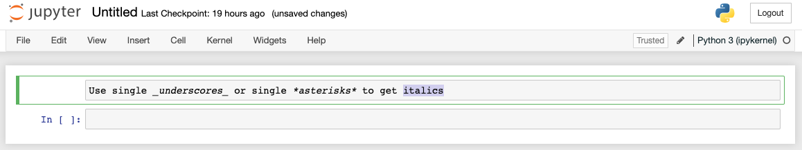
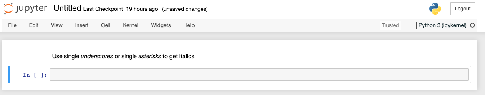
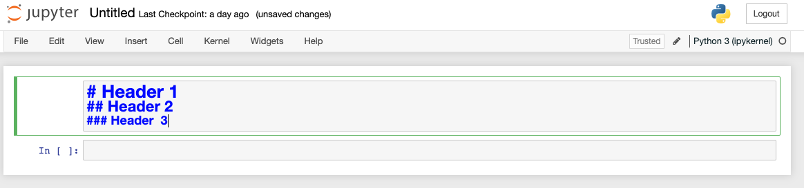
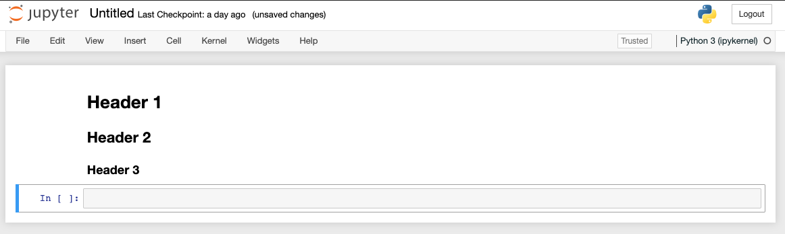
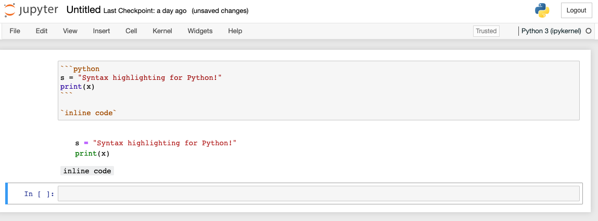

**The code `pd_episode01_intro.ipynb` for this episode can be downloaded from [here](https://osf.io/9cy4u/download)**

## What is Python?
Python is a general purpose programming language which means that it wasn't designed
to solve a particular problem or group of problems (like R or Matlab) but **any** problem you 
can think of to solve on a computer. Consequently, you can use Python to do almost anything from 
analyze data to running computer systems to creating games.

Though comprised of fairly basic syntax (i.e. the grammar of the commands you give it) it is incredibly
powerful. It is relatively easy to pick up as well and thanks to a very large and growing
set of external modules (or blocks of code) written by other programmers, you can do complicated things
quickly and easily.

One of the reasons for this power is that it is (to a certain degree) an **interpreted** language. This means that the code
you type gets translated into instructions the computer can understand as Python reads it. There is not a
separate optimisation or 'compilation' step to create your executable/binary before you can run your code like there is with some other languages like C++. This
allows the language to be very dynamic but does have the drawback of being slower than others.
However, there are many ways Python has of overcoming these drawbacks and you will almost certainly
never notice a problem!

## Getting Started

Before we can get to grips with analyzing the arthritis dataset, we must first find out how to run
Python itself. For the time being, we will use a Jupyter Notebook which again is an open source web application that you can use to create and share documents that contain live code, equations, visualizations, and text. The notebook acts like the Shell but for Python commands. In other words, when you type your instructions at the prompt and press
enter, it will be run straight away.

If you haven't already, you can start up the Jupyter notebook server from the shell by typing the following:
~~~
$ jupyter notebook
~~~
{: .language-shell}

Note that the output upon launch the notebook server will vary depending on your computer and how you've got Python installed.

~~~
[I 14:26:35.122 NotebookApp] Serving notebooks from local directory: /Users/jpcourneya/Desktop/swc-python
[I 14:26:35.122 NotebookApp] Jupyter Notebook 6.4.2 is running at:
[I 14:26:35.122 NotebookApp] http://localhost:8888/?token=426e9bbab9c25462f6af45ccca1f2cf94086cf1f5e3a5fe4
[I 14:26:35.122 NotebookApp]  or http://127.0.0.1:8888/?token=426e9bbab9c25462f6af45ccca1f2cf94086cf1f5e3a5fe4
[I 14:26:35.122 NotebookApp] Use Control-C to stop this server and shut down all kernels (twice to skip confirmation).
[C 14:26:35.136 NotebookApp] 
    
    To access the notebook, open this file in a browser:
        file:///Users/jpcourneya/Library/Jupyter/runtime/nbserver-84911-open.html
    Or copy and paste one of these URLs:
        http://localhost:8888/?token=426e9bbab9c25462f6af45ccca1f2cf94086cf1f5e3a5fe4
     or http://127.0.0.1:8888/?token=426e9bbab9c25462f6af45ccca1f2cf94086cf1f5e3a5fe4
~~~
{: .output}

This will start up Jupyter and your default browser should start (or open a new tab) to the following URL: <http://localhost:8888/tree>

Your browser should now look something like this:

At this point you are not actually running a Notebook, but instead you are just running the Notebook server. To write and execute Python code we'll need a Jupyter notebook. You will notice all notebooks have the file extension `.ipynb`. Theres history behind this as Jupyter Notebooks were formerly known as [IPython Notebooks](https://ipython.org/notebook.html). Let’s actually create a Notebook now!

## Creating a Notebook

After starting a Notebook server the next thing to do is create or open an actual Notebook document! 

To create the Notebook click the <KBD>New</KBD> button (upper right) which opens a drop down with a list of choices. You will select the option for Python 3. The webpage should now look like this:

## Naming your notebook

You will notice that at the top of the page is the word Untitled. This is the title for the page and the name of your Notebook. Go ahead and change it to something more meaningful

Just move your mouse over the word `Untitled` and click on the text. You should now see an in-browser dialog titled Rename Notebook. Let’s rename this one to `PD-Episode01`:

## Running Cells

A Notebook’s cell defaults to using code whenever you first create one, and that cell uses the kernel that you chose when you started your Notebook.

In this case, you started yours with Python 3 as your kernel, so that means you can write Python code in your code cells. Since your initial Notebook has only one empty cell in it, the Notebook can’t really do anything.

Thus, to verify that everything is working as it should, you can add some Python code to the cell and try running its contents.

## Getting Python to do something

Now we can start and (possibly more importantly!) exit Python, we can try to get it do something
by giving it a command. The Jupyter Notebook intepreter (i.e. the `In [x]:` prompt) works in
a very similar way to the shell except that here you will be typing python code directly instead
of running programs. We shall start by getting Python to print something. This is very basic but
will be invaluable going forward:

~~~
print("Hello World")
~~~
{: .language-python}

Running a cell means that you will execute the cell’s contents. To execute a cell, you can just select the cell and click the Run button that is in the row of buttons along the top. It’s towards the middle. If you prefer using your keyboard, you can just press <KBD>Shift</KBD>+<KBD>Enter</KBD>.

So what did we just do? We typed in a python statement that was interpreted by Python and acted
on when we pressed <KBD>Shift</KBD>+<KBD>Enter</KBD>. It interpreted this as 'call the function `print` with the argument
`"Hello World"`. It went away, ran the appropriate code and returned.

But what does the `print` function do? In this case, it's fairly self-expanatory but if you wanted
to know more you can use the `help` function:

~~~
help(print)
~~~
{: .language-python}
~~~
Help on built-in function print in module builtins:

print(...)
    print(value, ..., sep=' ', end='\n', file=sys.stdout, flush=False)
    
    Prints the values to a stream, or to sys.stdout by default.
    Optional keyword arguments:
    file:  a file-like object (stream); defaults to the current sys.stdout.
    sep:   string inserted between values, default a space.
    end:   string appended after the last value, default a newline.
    flush: whether to forcibly flush the stream.
~~~
{: .output}

Jupyter Notebooks also have shell-like behavior in that you can use `Tab` to auto-complete a function or variable name:

~~~
pri [Tab]
~~~
{: .language-python}

~~~
print
~~~
{: .language-python}

> ## Exploring Tab Completion
>
> On up-to-date versions of Jupyter, the Tab completion functionality will also suggest the commands
> you mean if several match and also show the arguments a function might take.
>
> Give this a try by doing:
>
> ~~~
> pr [Tab]
> print( [Tab]
> ~~~
> {: .language-python}
>
> What happens if you press `Tab` multiple times?
{: .challenge}

An important thing to remember whenever programming in Python though is that the code is 
**case sensitive**. This means that `print` is completely different and unrelated to `Print`.
To show this, type the following:

~~~
Print("Hello World")
~~~
{: .language-python}

~~~
---------------------------------------------------------------------------
NameError                                 Traceback (most recent call last)
<ipython-input-1-82ee0b7fee85> in <module>()
----> 1 Print("Hello World")

NameError: name 'Print' is not defined
~~~
{: .error}

As you can see, Python didn't know what `Print` was so showed an error (a `NameError` in this case).

## Jupyter Notebook menus

The Jupyter notebook has several menus that help you interact with the notebook. The menus are found along the top similar to menus from other applications. You are encouraged to go through the menu tabs and explore what possibilities exist within each. It is worth noting that many of the commands within the menu tabs will provide a corresponding keyboard short-cut to use them for reducing mouse fatigue. Use of the menu resources will become more apparent as you proceed in working with Jupyter Notebooks. 

The _Help_ menu is particularly useful. The _Help_ menu is where you go to learn about the Notebook’s keyboard shortcuts, a user interface tour, and lots of reference material.

## Adding Rich Content to your Notebook
Jupyter Notebook supports adding rich content to its cells. Lets take a look some of the things you can do with your cells using Markup and Code.

### Cell Types

There are 3 cell types you can create in a Notebook: Code, Markdown, Raw NBConvert. The <KBD>Cell</KBD> menu _Cell Type_ selection shows you them with their corresponding keyboard short-cut:

The primary cell types that you will use are the Code and Markdown cell types. You have already learned how code cells work, so let’s learn how to style your text with Markdown.

### Styling text with Markdown
Jupyter Notebook supports Markdown, which is a markup language that is a superset of HTML. We will look at some of the basic styling possible using Markdown in the following examples, for a more extensive guide visit: [Ultimate Markdown Guide](https://medium.com/analytics-vidhya/the-ultimate-markdown-guide-for-jupyter-notebook-d5e5abf728fd)

To write Markdown in the Notebook, lets first set a new cell to Markdown or use keyboard short-cut <KBD>M</KBD> and add some text to the cell: 

Run the cell using your favorite method and it should look like this: 

To make your text **BOLD**, use a double underscore or a double asterisk.

Creating headers in Markdown involves placing a pound sign at the beginning of a line and making a space after! The more pound signs you use, the smaller the header. Jupyter Notebook even kind of previews it for you:

Running the cell you are left with a beautiful header for your notebook. 

In case you want to insert a code example that you don't expect to be run by the end user, there's a Markdown for that too! For inline code highlighting, just surround the code with backticks. If you want to insert a block of code, you can use triple backticks and also specify the programming language:

Jupyter notebooks provide a wide set of features to explore and use. You will want to investigate more on the topic. Some important topics not covered are Exporting Notebooks, Installing Kernels, Notebook extensions, hosting your Jupyter Notebook on Jupyter Hub and more!

> ## Python vs. Jupyter
>
> You may be wondering why you type `jupyter notebook` to run the Python interpreter rather than just
> `python`. This does also work but this is a much more basic interpreter than Jupyter Notebook that
> doesn't have tab completion, syntax highlighting, etc. If you ever need an interactive
> Python prompt, Jupyter notebook is the best option!
{: .callout}

To quit out, you can do the following:

* Hit the <KBD>Quit</KBD> button then close the browser tab
* In the shell press <KBD>Cntrl</KBD> <KBD>C</KBD> twice anmd then close the browser tab containing the running Jupyter Notebook. 

This will then drop you back to the shell prompt you were at before.
